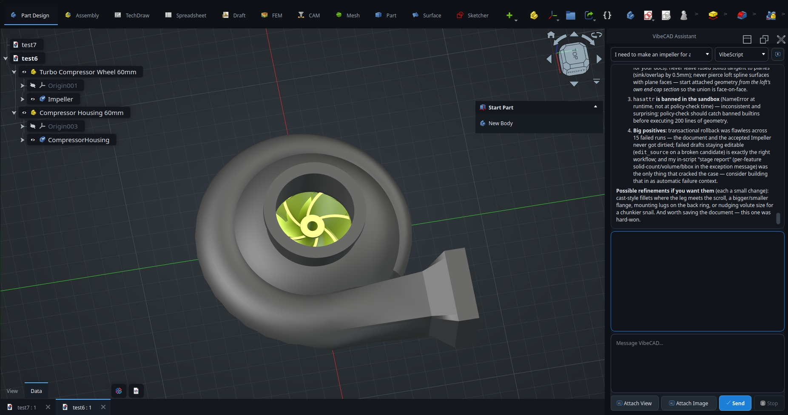

<p align="center">
  
</p>

# VibeCAD

VibeCAD is an AI-native parametric CAD platform for designing real 3D parts through conversation, direct modeling tools, and editable geometry history.



## What It Is

VibeCAD gives the model access to CAD-native operations instead of treating design as a text-to-mesh trick. The assistant can inspect the active document, reason about the current part, call modeling tools, and explain what changed in the same conversation where the user describes intent.

The goal is not fully autonomous CAD. The goal is a practical design surface where the human owns intent and the AI performs high-quality CAD work with enough visibility that the user can steer, correct, and continue.

## Highlights

- AI assistant panel with persisted conversation, live reasoning/tool activity, and steering in one resizable surface.
- Tool availability follows the human-selected FreeCAD workbench and the real active edit object; there is no separate phase state machine.
- Focused PartDesign and Sketcher surfaces for native editable bodies, references, constrained profiles, features, transforms, dress-ups, screenshots, and in-place repair.
- Local and cloud model support through configurable providers, including OpenAI-compatible local servers.
- VibeLight and VibeDark themes with modern chrome, panel styling, and assistant integration.
- Release packaging for Linux and Windows so the full application can be tested outside a development checkout.

## Install

Download the latest build from the repository Releases page.

The release assets are intended to include:

- Linux AppImage
- Linux Debian package
- Windows installer
- Windows portable archive
- SHA256 checksum files

On Linux, make the AppImage executable and run it:

```bash
chmod +x VibeCAD*.AppImage
./VibeCAD*.AppImage
```

On Windows, run the installer from the release assets and launch VibeCAD from the Start menu.

## Local Models

For local OpenAI-compatible servers, configure the provider with the local endpoint and model name. For Ollama, the common setup is:

```text
Base URL: http://localhost:11434/v1
Model: your-local-model
API key: any non-empty value accepted by the local server
Reasoning effort: none
```

Some local models reject thinking/reasoning parameters. Set reasoning effort to `none` for those models.

## Development Notes

VibeCAD is built around a real CAD document, not a disposable generated object. When a user asks to fix, improve, optimize, or continue an existing model, the current design is the authority. The assistant should inspect the active document, identify the target object, and modify that object unless the user explicitly asks for a replacement.

The human creates, opens, saves, and selects the document and workbench. VibeCAD receives the current CAD state automatically and exposes only operations that are valid for that workbench and edit mode. Unsupported workbenches do not receive partial legacy tool packs.

The assistant UI should keep the human oriented:

- user messages are shown as conversation,
- model thinking is shown separately,
- tool calls and CAD mutations are visible as progress,
- final prose responses are readable and markdown-aware.

Release packaging details live in [docs/vibecad-release-packaging.md](docs/vibecad-release-packaging.md).

## Status

VibeCAD is under active development. The current focus is making AI-assisted part design reliable, readable, and useful for real modeling work before broadening the same quality bar across assembly, manufacturing, and analysis workflows.
