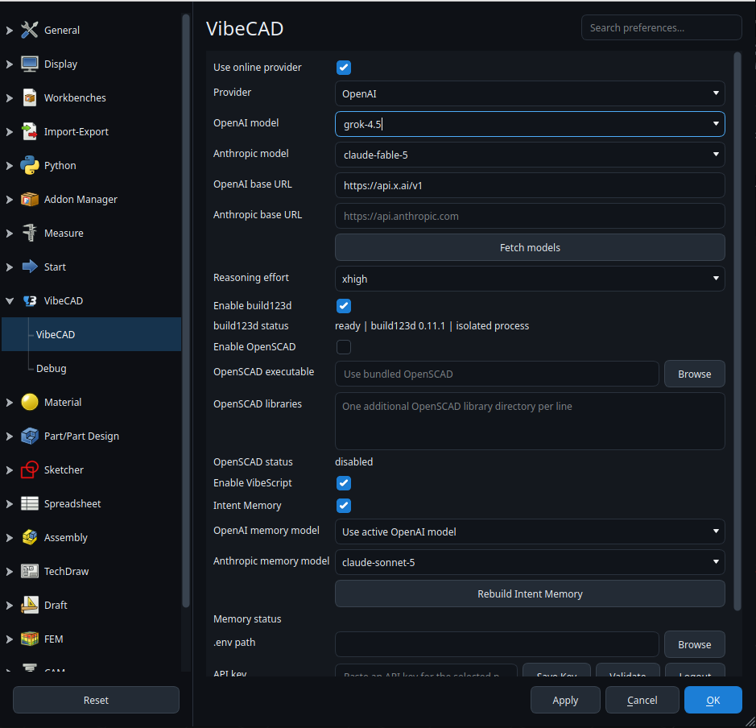

<p align="center">
  
</p>

# VibeCAD

VibeCAD is an AI-native parametric CAD platform for designing real 3D parts through conversation, focused modeling tools, and editable geometry history.


## Before You Start

**You need an API key for the AI provider you select.** VibeCAD currently connects directly to OpenAI and Anthropic, and it can use OpenAI-compatible endpoints such as xAI, Ollama, and other local model servers.

Store the key in one of these places:

- **OS keyring (recommended):** paste the key in VibeCAD Preferences, click **Save Key**, and then click **Validate**.
- **A selected `.env` file:** create the file yourself, select it in VibeCAD Preferences, and click **Validate**. VibeCAD does not search for `.env` files automatically.

API keys are not stored in ordinary application preferences.

## Install

Download the latest build from [VibeCAD Releases](https://github.com/10-X-eng/vibecad/releases/latest).

### Linux AppImage

```bash
chmod +x VibeCAD*.AppImage
./VibeCAD*.AppImage
```

### Debian Package

Run this command from the directory containing the downloaded package:

```bash
sudo apt install ./vibecad_*_amd64.deb
```

The leading `./` is required when installing a local package with `apt`.

### Windows

Download the Windows installer, run it, and launch VibeCAD from the Start menu. A portable archive is also available for installations that should not modify the system.

SHA256 files are published beside release artifacts so downloads can be verified before installation.

## Configure an AI Provider

Open **Preferences**, then select **VibeCAD > VibeCAD**.

1. Enable **Use online provider**.
2. Select **OpenAI** or **Anthropic** under **Provider**.
3. Leave the provider's base URL blank for its official service. Set a base URL only when using a compatible service or local endpoint.
4. Configure the API key using the keyring or `.env` method below.
5. Click **Fetch models**, then select a returned model.
6. Choose a supported **Reasoning effort**. Use `none` when a model does not support thinking or reasoning parameters.
7. Click **Apply** or **OK** to save the provider, model, endpoint, and `.env` path settings.

### Save a Key in the OS Keyring

1. Select the provider first. Keys are stored separately for OpenAI and Anthropic.
2. Paste the provider key into **API key**.
3. Click **Save Key**. The field clears after VibeCAD hands the key to the operating system's credential store.
4. Click **Validate**. A successful check reports `verified` in **Auth status**.
5. Click **Fetch models** and choose the model to use.

**Logout** removes only the selected provider's keyring entry. It does not remove a process environment variable or edit a selected `.env` file.

### Use a `.env` File

Create a text file containing the variable for the selected provider:

```dotenv
# OpenAI and OpenAI-compatible providers, including xAI
OPENAI_API_KEY=your-key-here

# Anthropic
ANTHROPIC_API_KEY=your-key-here
```

In VibeCAD Preferences:

1. Click **Browse** beside **.env path** and select that exact file.
2. Leave the **API key** field empty; **Save Key** is only for the OS keyring.
3. Click **Validate**, then **Fetch models**.
4. Click **Apply** or **OK** so the selected path is used by future sessions.

Do not commit a `.env` file containing a real key to source control.

### Credential Precedence

VibeCAD resolves a key in this order:

1. The provider's process environment variable.
2. The `.env` file explicitly selected in Preferences.
3. The OS keyring.

This order matters when a valid key appears to be ignored. For example, an old `OPENAI_API_KEY` exported by the shell overrides both the selected `.env` file and a newer key saved in the keyring.

## Configure Grok Through xAI

xAI exposes an OpenAI-compatible API, so Grok uses VibeCAD's OpenAI provider adapter:

1. Obtain an API key from xAI.
2. Select **OpenAI** as the provider.
3. Set **OpenAI base URL** to `https://api.x.ai/v1`.
4. Paste the xAI key, click **Save Key**, and then click **Validate**.
5. Click **Fetch models** and select the Grok model returned by xAI.
6. Choose a reasoning effort supported by that model, then click **Apply** or **OK**.

When using a `.env` file for xAI, use `OPENAI_API_KEY` because the OpenAI-compatible provider adapter is selected.



## Start a CAD Conversation

1. Create or open a CAD document and **save it**. VibeCAD keeps the assistant disabled for unsaved documents so the conversation, design record, references, and generated source have a durable project location.
2. Select the workbench that matches the work you are doing. VibeCAD exposes the focused tool surface for the active workbench.
3. Open **View > Panels > VibeCAD Assistant** if the assistant is not visible.
4. Describe the intended result, including the dimensions, interfaces, material, manufacturing process, and constraints that matter.
5. Use **Attach Image** for a reference design, or paste an image into the message box with `Ctrl+V`. Use **Attach View** to include the current viewport.
6. Click **Send**. While work is running, the same input becomes **Steer**, so corrections stay in the same conversation. **Stop** ends the run after the current provider or CAD step returns.
7. Save the CAD document normally. Reopening it restores the associated VibeCAD conversations and project records.

Be explicit about functional intent, not only appearance. For an existing model, identify what should be preserved and what should change. For a new part, provide mating geometry and critical dimensions whenever they are known.

## Conversations

The conversation selector at the top of the assistant opens prior conversations for the current CAD document. The new-conversation button starts a clean thread without deleting earlier work. This makes it possible to separate a redesign, manufacturing discussion, or analysis task while retaining the project's history.

When **Intent Memory** is enabled in Preferences, VibeCAD compiles durable project intent after completed conversations. This preserves important requirements without replaying an unlimited chat transcript on every model call.

## PartDesign Modeling Engines

The modeling-engine selector appears in the VibeCAD panel while PartDesign is active. The human controls this selection for each saved CAD document.

- **Native:** editable sketches and PartDesign feature history.
- **VibeScript:** VibeCAD's native scripted modeling engine; enabled by default.
- **build123d:** optional Python-based scripted modeling, enabled in Preferences.
- **OpenSCAD:** optional editable OpenSCAD source, enabled in Preferences.

Scripted engines keep source, parameters, diagnostics, and accepted outputs with the project. Their temporary preview is not the saved model; inspect it in the **Model Code Editor** and use **Accept** to commit the candidate result.

## Local Models

For Ollama or another local OpenAI-compatible server, select the OpenAI provider and configure its endpoint. A common Ollama setup is:

```text
OpenAI base URL: http://localhost:11434/v1
Model: select a model returned by Fetch models
API key: any non-empty value accepted by the local server
Reasoning effort: none
```

The local server must already be running and expose an OpenAI-compatible API. Some local models reject reasoning parameters even when the server supports the endpoint; use `none` for those models.

## Troubleshooting

- **`not_configured`:** VibeCAD could not find the selected provider's environment variable, a valid key in the selected `.env` file, or a keyring entry.
- **`configured_unverified`:** a key was found but has not been checked against the configured endpoint. Click **Validate**.
- **`invalid`:** the endpoint rejected the key. Confirm the selected provider, base URL, credential precedence, and account access.
- **`offline`:** the key could not be verified because the configured endpoint could not be reached.
- **No models are listed:** validate authentication first, then click **Fetch models**.
- **The model does not support thinking:** set **Reasoning effort** to `none`.
- **The assistant input is disabled:** save the active CAD document.
- **The assistant panel was closed:** reopen it from **View > Panels > VibeCAD Assistant**.

## Project Status

VibeCAD is under active development. The current focus is reliable, readable AI-assisted part design with explicit human control over the document, workbench, modeling engine, and design direction.

Release packaging details are documented in [docs/vibecad-release-packaging.md](docs/vibecad-release-packaging.md).

## Credits

- The VibeLight and VibeDark themes are based on [OpenTheme by Obelisk79](https://github.com/obelisk79/OpenTheme).
- VibeCAD is built on the work of the [FreeCAD project](https://github.com/FreeCAD/FreeCAD). Thank you to the contributors and the wider [FreeCAD community](https://forum.freecad.org/) whose CAD engine, workbenches, documentation, and support made this project possible.
